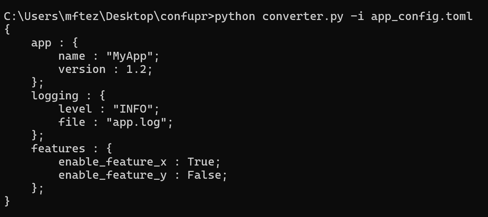
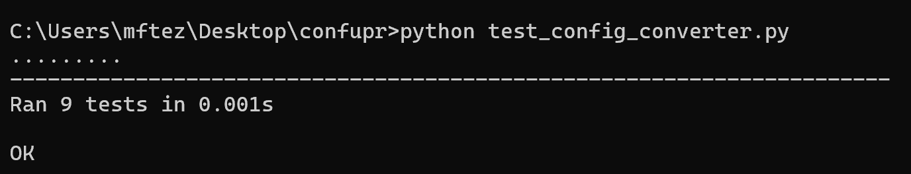

# converter
3 homework config mirea
# config-converter
Третье домашнее задание по Конфигурационному Управлению

## Постановка задачи

### Задание №3
Разработать инструмент командной строки для учебного конфигурационного языка, синтаксис которого приведен далее. Этот инструмент преобразует текст из входного формата в выходной. Синтаксические ошибки выявляются с выдачей сообщений.

Входной текст на языке TOML принимается из файла, путь к которому задан ключом командной строки. Выходной текст на учебном конфигурационном языке попадает в стандартный вывод.

#### Синтаксис учебного конфигурационного языка:

- **Однострочные комментарии:**
  ```
// Это однострочный комментарий
  ```

- **Словари:**
  ```
{
    имя : значение;
    имя : значение;
    имя : значение;
    ...
}
  ```

- **Имена:**
  ```
[_a-zA-Z]+
  ```

- **Значения:**
  - Числа.
  - Словари.

- **Объявление константы на этапе трансляции:**
  ```
const имя = значение
  ```

- **Вычисление константы на этапе трансляции:**
  ```
@[имя]
  ```

Результатом вычисления константного выражения является значение.

Все конструкции учебного конфигурационного языка (с учетом их возможной вложенности) должны быть покрыты тестами. Необходимо показать 2 примера описания конфигураций из разных предметных областей.

### Как запустить

Для запуска конвертера ввести в консоль:

```bash
python converter.py -i "C:\Users\Пользователь\Desktop\конфигурационка\config.toml"
```

Для запуска тестов ввести в консоль:

```bash
python test_config_converter.py
```

## Описание алгоритма

1. **Классы и исключения:**
   
   - **ConfigConverterError**: Кастомное исключение для обработки ошибок конвертации.
   
   - **Converter**: Основной класс, отвечающий за преобразование данных TOML в учебный конфигурационный язык. Хранит константы, генерируемые во время преобразования, и формирует выходной текст с учётом отступов и синтаксиса языка.

2. **Преобразование данных TOML:**
   
   - **Метод `convert`:**
     - Проверяет, что верхний уровень TOML-файла является словарём.
     - Запускает процесс конвертации, добавляя открывающую фигурную скобку и переходя к обработке словаря.

   - **Метод `process_dict`:**
     - Итерация по ключам и значениям словаря.
     - Проверка валидности имени ключа согласно правилу `[_a-zA-Z]+`.
     - В зависимости от типа значения (`dict`, `int`, `float`, `str`, `bool`), обрабатывает его соответствующим образом:
       - **Словари**: Рекурсивно обрабатывает вложенные словари, добавляя соответствующие отступы и скобки.
       - **Числа и строки**: Объявляет константы на этапе трансляции и заменяет значения на ссылки на константы.
       - **Булевы значения**: Обрабатывает как строковые константы `"true"` и `"false"`.

3. **Обработка констант:**
   
   - **Метод `process_value`:**
     - Если значение является числом или строкой, создаёт уникальное имя константы, основанное на текущем пути в структуре данных, чтобы избежать дублирования.
     - Добавляет объявление константы в список констант.
     - Возвращает ссылку на константу в формате `@[имя_константы]`.
     - Если константа уже существует с другим значением, выбрасывает ошибку `ConfigConverterError`.

4. **Генерация выходного текста:**
   
   - Объявление констант добавляется в начало выходного текста, разделённое пустой строкой от основного содержимого.
   - Основное содержимое формируется в виде вложенных словарей с правильными отступами и заменами значений на константы.

5. **Обработка ошибок:**
   
   - При обнаружении недопустимых имён или неподдерживаемых типов значений выбрасываются соответствующие исключения с информативными сообщениями.

## Как работает программа

1. **Запуск инструмента**: Программа запускается из командной строки с указанием пути к TOML-файлу.
   
2. **Загрузка данных**: Файл TOML загружается и парсится с использованием библиотеки `toml`.
   
3. **Преобразование данных**: Класс `Converter` обрабатывает загруженные данные, создавая константы и формируя выходной конфигурационный текст.
   
4. **Вывод результата**: Конфигурационный текст выводится в стандартный вывод (консоль).
   
5. **Обработка ошибок**: В случае обнаружения синтаксических ошибок в TOML-файле или при конвертации, выводятся соответствующие сообщения об ошибках.


#### Примеры тестирования


1. **Вывод программы:**

    


2. **Результаты unittest:**

    

